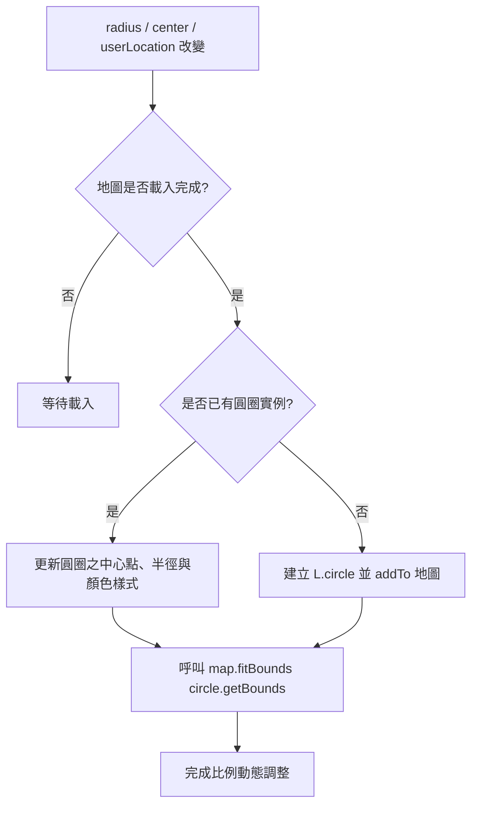

# 地圖比例隨搜尋半徑動態縮放設計規格書 (Design Spec)

本文件規劃如何在地圖模式中，當使用者縮放搜尋半徑或切換搜尋中心時，地圖的縮放比例 (Zoom Level) 能自動調整到剛好包覆整個搜尋範圍，並在地圖上繪製對應半徑的半透明範圍圓圈，提升使用者體驗。

## 1. 需求背景
目前專案的地圖模式在初始化時，縮放級別 (Zoom Level) 被固定為 `14`。當使用者調整搜尋半徑（0.5 km 至 10 km）時，地圖不會自動調整比例。這會導致以下問題：
- 當半徑縮小時（如 0.5 km），地圖視野太大，使用者無法看清中心點附近的店家。
- 當半徑放大時（如 10 km），地圖視野太小，超出版面的店家標示 (Markers) 會無法呈現在畫面上，且使用者無從得知目前的搜尋範圍。

## 2. 設計方案：主動式 L.circle 結合 fitBounds
為了在各種裝置（桌機寬螢幕與手機窄螢幕）上都能精確且優雅地呈現搜尋半徑範圍，我們採用 **Leaflet 範圍圓圈結合自動邊界貼合 (fitBounds)** 的方案。

### 2.1 系統架構與元件 Props 修改

#### [page.tsx](file:///Users/ccchang/Project/NationalTravelCardMerchants/frontend/src/app/map/page.tsx)
- 在 [page.tsx](file:///Users/ccchang/Project/NationalTravelCardMerchants/frontend/src/app/map/page.tsx) 的 `MapContent` 元件中，將目前的 `radius` 狀態傳遞給 `MapView` 元件。

#### [MapView.tsx](file:///Users/ccchang/Project/NationalTravelCardMerchants/frontend/src/components/MapView.tsx)
- 更新 `MapViewProps` 介面，新增 `radius: number` 屬性（單位為公里）。

```typescript
interface MapViewProps {
  merchants: Merchant[];
  center: [number, number];
  userLocation: [number, number] | null;
  onMapClick: (lat: number, lon: number) => void;
  selectedMerchant: Merchant | null;
  onSelectMerchant: (m: Merchant) => void;
  radius: number; // 新增
}
```

### 2.2 圓圈繪製與更新邏輯

在 `MapView` 中，使用一個 `circleRef` (useRef) 追蹤與管理地圖上的圓圈，防止因 React 重新渲染而重複建立 Leaflet 物件。

1. **中心點選擇**：
   - 優先使用 `userLocation` (使用者定位) 作為圓心。
   - 若無定位，則使用 `center` (地圖中心/地址搜尋點) 作為圓心。

2. **配色與樣式**：
   - **定位模式**：圓圈使用藍色 (`#3B82F6`)，與定位點同色調。
   - **自選中心模式**：圓圈使用綠色 (`#10B981`)，與中心大頭針同色調。
   - **樣式設定**：
     - 線條粗細 (`weight`)：`1`
     - 線條透明度 (`opacity`)：`0.6`
     - 填滿透明度 (`fillOpacity`)：`0.06`
     - 半徑：`radius * 1000` (公尺)

3. **邊界貼合 (fitBounds)**：
   每次圓圈建立或更新後，調用 Leaflet 的 `map.fitBounds(circle.getBounds(), { padding: [20, 20], animate: true })`，自動計算最佳的 Zoom Level 與中心點，使圓圈邊緣與地圖邊緣保留 20 像素的留白。

### 2.3 流程圖


## 3. 測試與驗證計畫
1. **半徑變更測試**：在網頁上拖曳半徑 slider (從 0.5km 到 10km)，驗證地圖比例是否隨之平滑縮放。
2. **中心點切換測試**：
   - 點擊「定位我的位置」，確認地圖比例與圓圈中心切換至使用者定位（藍色）。
   - 在地圖上任意點擊或搜尋地址，確認圓圈與比例切換至新的中心（綠色）。
3. **響應式測試**：在不同螢幕解析度（如手機模擬器）下，確認範圍圓圈不會超出畫面。
