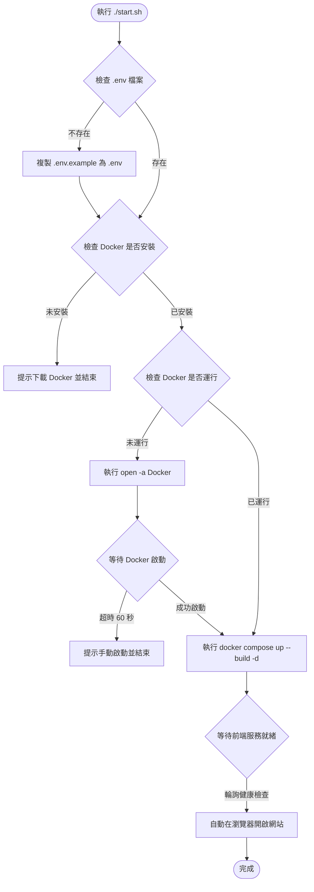

# 國旅卡特約商店查詢系統 — macOS 一鍵啟動腳本設計規格書

本文件說明專門為 macOS (MacBook Pro) 開發的一鍵啟動腳本設計與實作規劃。

## 1. 背景與目標
本專案包含後端 (FastAPI)、前端 (Next.js) 以及排程器 (supercronic)，並使用 Docker Compose 進行容器化管理。
為了降低開發者或使用者的啟動門檻，本腳本目標是提供一個一鍵運行的環境準備與啟動工具，自動處理以下事項：
1. 本地 `.env` 環境變數配置準備。
2. Docker Desktop 的安裝與運行狀態檢測。
3. 在 macOS 上自動開啟 Docker Desktop（若尚未運行）。
4. 呼叫 Docker Compose 建置並啟動服務。
5. 監控前端服務健康狀態，並在就緒時自動使用預設瀏覽器打開網頁。

## 2. 設計架構與執行流程



## 3. 詳細設計規格

### 3.1 檔案命名與放置
* 檔案名稱：`start.sh`
* 放置路徑：專案根目錄下
* 權限要求：必須具備可執行權限 (`chmod +x start.sh`)

### 3.2 關鍵功能實作細節

#### A. 顏色日誌輸出
使用 ANSI 轉義序列提供彩色排版輸出：
* 綠色 (`\033[0;32m`): 成功 / 步驟完成
* 黃色 (`\033[0;33m`): 進行中 / 警告
* 紅色 (`\033[0;31m`): 錯誤 / 異常中斷
* 藍色 (`\033[0;34m`): 系統提示訊息

#### B. 環境變數處理
檢查根目錄下有無 `.env` 檔案。若無，將執行：
```bash
cp .env.example .env
```

#### C. Docker 守護行程 (Daemon) 自動啟動與輪詢
* 檢查 Docker 是否安裝：`command -v docker`
* 檢查 Docker 是否正在運行：`docker info >/dev/null 2>&1`
* 開啟 Docker Desktop：`open -a Docker`
* 輪詢等待：
  ```bash
  local timeout=60
  local elapsed=0
  while ! docker info >/dev/null 2>&1; do
      if [ $elapsed -ge $timeout ]; then
          # 提示超時並退出
          exit 1
      fi
      sleep 2
      elapsed=$((elapsed + 2))
  done
  ```

#### D. 容器建置與背景運行
* 命令：`docker compose up --build -d`

#### E. 服務就緒監測與自動開啟網頁
* 從 `.env` 中提取 `FRONTEND_PORT`（預設值為 `3000`）。
* 使用 `curl` 輪詢 `http://localhost:${FRONTEND_PORT}`：
  ```bash
  while ! curl -s -o /dev/null -w "%{http_code}" http://localhost:${FRONTEND_PORT} | grep -q "200\|301\|302\|307\|308"; do
      sleep 1
  done
  ```
* 網頁就緒後，使用 `open http://localhost:${FRONTEND_PORT}` 開啟瀏覽器。

## 4. 驗證與測試計畫
實作完成後，將透過以下測試案例進行驗證：
1. **全新環境測試：** 刪除 `.env`，關閉 Docker Desktop。執行 `./start.sh`，驗證是否自動複製環境設定、開啟 Docker Desktop、啟動服務並自動打開瀏覽器。
2. **正常運行測試：** 在 Docker Desktop 已開啟且 `.env` 已存在的情況下執行 `./start.sh`，驗證是否能快速啟動並開啟瀏覽器。
3. **無 Docker 環境測試（模擬）：** 暫時將 `docker` 改名或模擬找不到命令，驗證是否能給予使用者友善的下載指示。
