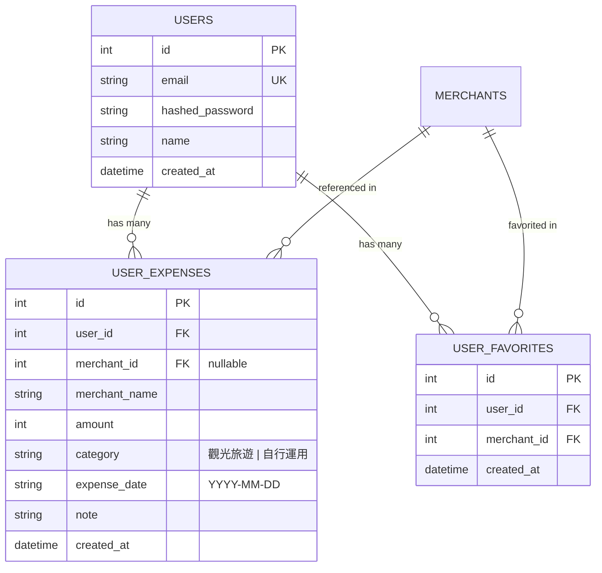

# 國民旅遊卡個人助手 (帳號、記帳與收藏模組) 設計規格書

- **日期**：2026-07-20
- **狀態**：已審核通過 (Approved)
- **主要目標**：為國民旅遊卡特約商店查詢平台新增會員系統、雙額度補助管理（觀光旅遊 8,000 元 + 自行運用 8,000 元）、刷卡記帳明細，以及商店收藏功能。

---

## 1. 系統架構與資料庫設計 (Database Schema & Architecture)

在現有 `merchants.db` 中新增三張資料表，並於 FastAPI 後端加入密碼加密（`passlib[bcrypt]`）與 JWT 權限驗證（`pyjwt`）。



### 資料表 DDL

```sql
CREATE TABLE IF NOT EXISTS users (
    id INTEGER PRIMARY KEY AUTOINCREMENT,
    email TEXT UNIQUE NOT NULL,
    hashed_password TEXT NOT NULL,
    name TEXT NOT NULL,
    created_at TIMESTAMP DEFAULT CURRENT_TIMESTAMP
);
CREATE UNIQUE INDEX IF NOT EXISTS idx_users_email ON users(email);

CREATE TABLE IF NOT EXISTS user_expenses (
    id INTEGER PRIMARY KEY AUTOINCREMENT,
    user_id INTEGER NOT NULL,
    merchant_id INTEGER,
    merchant_name TEXT NOT NULL,
    amount INTEGER NOT NULL CHECK (amount > 0),
    category TEXT NOT NULL CHECK (category IN ('觀光旅遊', '自行運用')),
    expense_date TEXT NOT NULL,
    note TEXT,
    created_at TIMESTAMP DEFAULT CURRENT_TIMESTAMP,
    FOREIGN KEY (user_id) REFERENCES users(id) ON DELETE CASCADE,
    FOREIGN KEY (merchant_id) REFERENCES merchants(id) ON DELETE SET NULL
);
CREATE INDEX IF NOT EXISTS idx_user_expenses_user ON user_expenses(user_id);

CREATE TABLE IF NOT EXISTS user_favorites (
    id INTEGER PRIMARY KEY AUTOINCREMENT,
    user_id INTEGER NOT NULL,
    merchant_id INTEGER NOT NULL,
    created_at TIMESTAMP DEFAULT CURRENT_TIMESTAMP,
    FOREIGN KEY (user_id) REFERENCES users(id) ON DELETE CASCADE,
    FOREIGN KEY (merchant_id) REFERENCES merchants(id) ON DELETE CASCADE,
    UNIQUE(user_id, merchant_id)
);
CREATE INDEX IF NOT EXISTS idx_user_favorites_user ON user_favorites(user_id);
```

---

## 2. 後端 API 規格 (Backend API Specification)

### 2.1 認證模組 (`backend/routers/auth.py`)

- `POST /api/auth/register`
  - **Body**: `{ "email": "str", "password": "str", "name": "str" }`
  - **Returns**: `{ "access_token": "str", "token_type": "bearer", "user": { "id": int, "email": "str", "name": "str" } }`
- `POST /api/auth/login`
  - **Body**: `{ "email": "str", "password": "str" }`
  - **Returns**: `{ "access_token": "str", "token_type": "bearer", "user": { "id": int, "email": "str", "name": "str" } }`
- `GET /api/auth/me`
  - **Header**: `Authorization: Bearer <token>`
  - **Returns**: User detail

### 2.2 個人助手與記帳模組 (`backend/routers/assistant.py`)

- `GET /api/assistant/summary`
  - **Header**: `Authorization: Bearer <token>`
  - **Returns**:
    ```json
    {
      "tourist_quota": { "target": 8000, "spent": 3500, "remaining": 4500, "percentage": 43.75 },
      "general_quota": { "target": 8000, "spent": 1200, "remaining": 6800, "percentage": 15.0 },
      "total_spent": 4700,
      "favorites_count": 5
    }
    ```
- `GET /api/assistant/expenses`
  - **Returns**: Array of user expenses ordered by `expense_date` DESC.
- `POST /api/assistant/expenses`
  - **Body**: `{ "merchant_id": int|null, "merchant_name": "str", "amount": int, "category": "觀光旅遊"|"自行運用", "expense_date": "YYYY-MM-DD", "note": "str" }`
- `DELETE /api/assistant/expenses/{id}`
  - Deletes an expense item owned by current user.
- `GET /api/assistant/favorites`
  - **Returns**: Array of favorited merchants (joined with `merchants` table).
- `GET /api/assistant/favorites/ids`
  - **Returns**: Array of merchant IDs favorited by current user (`[1, 5, 20, ...]`).
- `POST /api/assistant/favorites/{merchant_id}`
  - Favorites a merchant.
- `DELETE /api/assistant/favorites/{merchant_id}`
  - Unfavorites a merchant.

---

## 3. 前端 UX 與元件設計 (Frontend Architecture)

1. **`AuthContext.tsx`**：
   - 提供全站身份認證狀態，從 `localStorage` 讀取 Token，自動維持登入。
2. **`Navbar.tsx`**：
   - 未登入時：顯示登入/註冊彈窗入口。
   - 已登入時：顯示使用者名稱、額度完成小標籤、並選單跳轉至 `/dashboard` 或登出。
3. **`/dashboard` 頁面**：
   - **額度進度儀表板**：顯示觀光旅遊 8,000 元及自行運用 8,000 元進度條。
   - **記帳明細頁籤**：顯示記帳表格、可手動新增記帳或刪除紀錄。
   - **我的收藏頁籤**：清單卡片與地圖連動模式，標記所有收藏店家。
4. **商店卡片與詳情頁連動**：
   - 卡片右上角添加 ❤️ 愛心按鈕與 ➕ 記帳按鈕，登入後點擊直接同步。

---

## 4. 自動化測試與驗證計畫 (Testing & Verification Plan)

### 4.1 後端測試 (`backend/tests/`)
- `test_auth.py`:
  - 測試成功註冊、重複註冊擋退 (400 Bad Request)。
  - 測試 bcrypt 密碼驗證、正確與錯誤密碼登入 (401 Unauthorized)。
  - 測試 JWT 驗證與過期失效情況。
- `test_assistant.py`:
  - 測試消費紀錄新增、刪除與 Summary 算術結果。
  - 測試愛心收藏新增、重複收藏防範與取消收藏。
  - 測試多用戶資料權限隔離（使用者 A 無法存取/刪除使用者 B 的記帳或收藏）。

### 4.2 前端與系統建置驗證
- 執行 `pytest` 通過所有測試。
- 執行 `npm run lint` 與 `npm run build` 確認全站無型別與編譯錯誤。
